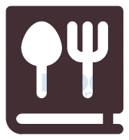

<a name="readme-top"></a>

<p align="center"></p>

# 📗 Table of Contents

- [📖 About the Project](#about-project)
  - [🛠 Built With](#built-with)
    - [Tech Stack](#tech-stack)
    - [Key Features](#key-features)
- [💻 Getting Started](#getting-started)
  - [Prerequisites](#prerequisites)
  - [Setup](#setup)
  - [Install](#install)
  - [Usage](#usage)
  - [Run tests](#run-tests)
  - [Deployment](#deployment)
- [👥 Authors](#authors)
- [🔭 Future Features](#future-features)
- [🤝 Contributing](#contributing)
- [⭐️ Show your support](#support)
- [🙏 Acknowledgements](#acknowledgements)
- [❓ FAQ (OPTIONAL)](#faq)
- [📝 License](#license)

# 📖 [Recipe App] <a name="about-project"></a>


**[The Recipe Application]** The Recipe Management System provides an intuitive and user-friendly interface for organizing and managing recipes. With its features for creating and tracking ingredients, users can easily keep track of their cooking essentials. Whether you are a home cook or a professional chef, this application is designed to simplify the process of managing and accessing your recipes. Enjoy your culinary adventures!.

## 🛠 Built With <a name="built-with"></a>

### Tech Stack <a name="tech-stack"></a>

- [ ] Ruby on Rails
- [ ] PostgreSql
- [ ] Gem

<details>
  <summary>Client</summary>
  <ul>
    <li><a href="https://rubyonrails.org/">Ruby on Rails</a></li>
  </ul>
</details>

<details>
<summary>Database</summary>
  <ul>
    <li><a href="https://www.postgresql.org/">PostgreSQL</a></li>
  </ul>
</details>

### Key Features <a name="key-features"></a>

- **[User Authentication: Users can create an account and securely log in to the system ]**
- **[Recipe Management: Users can create new recipes by providing a name, description, and other relevant details.]**
- **[Food Management: Users can manage their food items by creating, viewing, and deleting them..]**

<p align="right">(<a href="#readme-top">back to top</a>)</p>

## 💻 Getting Started <a name="getting-started"></a>

To get a local copy up and running, follow these steps.

### Prerequisites

In order to run this project you need:

- [ ] Ruby: [Installation Guide](https://www.ruby-lang.org/en/documentation/installation/)
- [ ] Ruby on Rails: [Installation Guide](https://guides.rubyonrails.org/getting_started.html#installing-rails)
- [ ] PostgreSQL: [Installation Guide](https://www.postgresql.org/docs/)

### Setup

Clone this repository to your desired folder:

```sh
  cd Rails_Capstone
  git clone https://github.com/Munyabelden/Rails_Capstone.git
```

### Install

Install this project with:

```sh
  cd Rails_Capstone
  bundle install
```
```sh
  gem install rspec
```
```sh
  gem install --no-document rubocop -v '>= 1.0, < 2.0' # https://docs.rubocop.org/en/stable/installation/
```
```sh
  npm install --save-dev stylelint@13.x stylelint-scss@3.x stylelint-config-standard@21.x stylelint-csstree-validator@1.x
```

### Usage

To run the project, execute the following command:

```sh
  rails db:create
```
```sh
  rails db:migrate
```
```sh
  rails server
```

### Run tests

To run tests, run the following command:

```sh
  rubocop --color
```
```sh
  npx stylelint "**/*.{css,scss}"
```
```sh
  rspec
```
### Deployment

You can deploy this project using:

- [ ] Use render or any other hosting of your choosing

<p align="right">(<a href="#readme-top">back to top</a>)</p>

## 👥 Authors <a name="authors"></a>

👤 **Belden Mugauri**

- GitHub: [@githubhandle](https://github.com/Munyabelden/)
- Twitter: [@twitterhandle](https://twitter.com/munyaradzi045)
- LinkedIn: [LinkedIn](https://www.linkedin.com/in/munyaradzi-mugauri-828a7b24a/)
  

<p align="right">(<a href="#readme-top">back to top</a>)</p>

## 🔭 Future Features <a name="future-features"></a>

- [ ] **[Descent UI design]**
- [ ] **[Form: for comments and like submition]**
- [ ] **[API: for posting]**

<p align="right">(<a href="#readme-top">back to top</a>)</p>

## 🤝 Contributing <a name="contributing"></a>

Feel free to check the [issues page](https://github.com/Munyabelden/Rails_Capstone/issues).

<p align="right">(<a href="#readme-top">back to top</a>)</p>

## ⭐️ Show your support <a name="support"></a>

If you like this project feel free to give it a star
## 🙏 Acknowledgments <a name="acknowledgements"></a>

I would like to thank Ruby on Rails team and Microverse

<p align="right">(<a href="#readme-top">back to top</a>)</p>

## 📝 License <a name="license"></a>

This project is [MIT](https://github.com/Munyabelden/Rails_Capstone/blob/main/LICENSE) licensed.

<p align="right">(<a href="#readme-top">back to top</a>)</p>